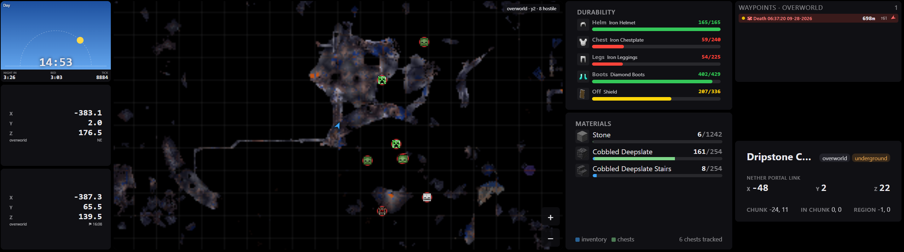

# Minecraft → Xeneon Edge HUD

Live Minecraft dashboard on the Corsair Xeneon Edge touchscreen in a kiosk browser (or as iCUE widgets),
fed by the [JourneyMap](https://modrinth.com/mod/journeymap) webmap API
(`http://localhost:8080`) plus a small client mod of its own for inventory,
armor and chest contents. Works with solo worlds **and Realms**, on any
Minecraft version JourneyMap supports (Fabric here; JourneyMap also ships
Forge/NeoForge builds if you ever switch loaders). Currently running on
Minecraft 26.3.



*Underground in a dripstone cave: the map has switched to the cave layer and shows
eight hostiles nearby, the chestplate and leggings are in the red, and the build
project has 6 chests' worth of cobbled deepslate counted.*

## Default layout

The dashboard is a configurable grid ([dashboard/config.js](dashboard/config.js),
documented in [dashboard/README.md](dashboard/README.md)). Out of the box it is
a 16 × 9 grid with the map in the middle, three panels down the left, gear and
build progress next to the map, and waypoints and environment on the right:

```
┌─────────┬─────────────────────────┬──────────┬─────────┐
│  Clock  │                         │Durability│Waypoints│
│day/night│                         │ helm     │direct-to│
├─────────┤                         │ chest    │         │
│ Coords  │        Live Map         │ legs …   ├─────────┤
│ (live)  │ mobs · villagers        ├──────────┤         │
├─────────┤ players · waypoints     │Materials │ Environ-│
│ Coords  │ + / − zoom              │ have/need│  ment   │
│ (tap)   │                         │ per item │         │
└─────────┴─────────────────────────┴──────────┴─────────┘
```

- **MC Live Map** (`widgets/map`) — chrome-free map centered on you with
  JourneyMap's radar drawn on it: hostile mobs (red ring), animals, villagers and
  other players (skin face and name), plus your waypoints with death points marked.
  Auto mode shows the night layer after dark and the cave layer underground (always
  in the Nether). **+ / −** buttons zoom (optionally snapping back after a while);
  each radar category, waypoints and labels can be switched off in the config.
- **MC Coordinates** (`widgets/coords`) — X/Y/Z, dimension, facing; updates twice a second.
- **MC Coordinates (tap)** (`widgets/coords-tap`) — updates **only when tapped** (or
  when you press **H** in game, with the mod below); shows the capture time. Use it to
  pin a spot (portal, base, drop chest) while you keep moving.
- **MC Day/Night Clock** (`widgets/clock`) — in-game time with the sun/moon on an arc,
  countdown to nightfall or dawn, and when the bed works.
- **MC Waypoints** (`widgets/waypoints`) — your JourneyMap waypoints by distance, with
  height difference and an arrow relative to where you face; death points pinned in red;
  tap a row to keep it on top.
- **MC Environment** (`widgets/environment`) — biome, the Nether/Overworld portal
  coordinates for where you stand, chunk and region.
- **MC Armor** (`widgets/armor`) — durability bars for your helmet, chestplate,
  leggings, boots and off hand (optionally the held item too): green → yellow →
  orange → red, a red ✕ for an empty slot. Needs the mod below.
- **MC Materials** (`widgets/materials`) — a build's shopping list (`smooth_stone:1242, …`
  in the config) with `have/need` per item, counting your inventory plus the chests
  you placed. Chests you find are ignored unless you claim them with a key while
  they are open. Needs the mod below.

The last two read the **iCUE HUD Bridge** mod in `mod/`, a small client-side Fabric
mod that serves your inventory, equipment and tracked chest contents on
`http://localhost:27421`. JourneyMap has no view of any of that. Item pictures are
the game's own sprites, or for 3D blocks (stairs, chests, shields) the Minecraft
Wiki's inventory renders, fetched once and cached locally.

Every panel's text size can be nudged per panel (`fontScale`), and the whole
layout, including which panels exist, lives in `dashboard/config.js`.

Change the grid, move panels, add a second map or a web page: edit
`dashboard/config.js` and the running dashboard picks it up within seconds.
All the options, examples and limitations are in [dashboard/README.md](dashboard/README.md).

## Setup

### 1. Mods (re-run after every Minecraft update)

```powershell
.\scripts\install-mods.ps1
```

Detects your newest Fabric profile, installs the matching **JourneyMap**,
**JourneyMap WebMap** and a **borderless fullscreen** mod (Borderless Fullscreen,
or Cubes Without Borders on 26.2 and older) from Modrinth, sets
`pauseOnLostFocus:false`, and pins the webmap to port 8080 (the port pin needs
one game launch first — run the script again after that). It also installs the
repo's own mod if it has been built (next step).

### 1b. The iCUE HUD Bridge mod (for the armor and materials widgets)

```powershell
.\scripts\build-mod.ps1
```

Builds `mod/` with Gradle and copies the jar into the mods folder. Fabric's
build tooling needs a JDK 25; if none is found the script downloads one into
`tools\` (gitignored). The first build takes a few minutes. The mod is pinned
to a Minecraft version: after a game update, set the new versions in
`mod/gradle.properties` (from [fabricmc.net/develop](https://fabricmc.net/develop))
and `mod/src/main/resources/fabric.mod.json`, then build again.

In game the mod adds two keys: **K** while a chest is open counts (or
un-counts) it for the materials widget, and **H** stamps your position onto
the coords-tap panel (see [dashboard/README.md](dashboard/README.md#mod-backed-widgets)).
Both can be changed in `.minecraft\config\icuehud\keys.properties` (created on
first launch; edits apply while the game runs).

Prereq: the [Fabric loader](https://fabricmc.net/use/installer/) profile for
your Minecraft version. Per Minecraft version this project needs that profile,
the Modrinth mods `install-mods.ps1` fetches, and a rebuild of the bridge mod;
the dashboard and widgets themselves are version-independent.

### 2. Focus guard (one-time)

```powershell
.\scripts\install-tasks.ps1
```

Registers `focus-guard.ps1` (and the dashboard launcher from step 3) as hidden at-logon tasks and starts them. When a tap
on the Edge steals focus from Minecraft, it gives focus straight back and snaps
the cursor to where it was — the widget still gets the tap, the game never
minimizes or loses input. Only the ultra-wide (32:9) monitor is guarded;
the other monitors behave normally. Remove with `-Uninstall`.

The borderless fullscreen mod (installed in step 1) keeps the game
full-screen-borderless so even a stolen focus can't minimize it. In Minecraft's
video settings, use its borderless toggle instead of vanilla fullscreen.

### 3. Dashboard on the Edge

In iCUE, turn **off "Show iCUE Widgets"** for the Xeneon Edge so it behaves as
a normal 2560x720 monitor. Then:

```powershell
.\scripts\start-dashboard.ps1
```

opens [dashboard/index.html](dashboard/index.html) as a fullscreen kiosk browser
window (Edge/Chrome with its own profile, pinch/swipe disabled) on the 32:9
monitor. Step 2's task installer also registers it to open automatically at logon
(`MinecraftHUD-Dashboard`). `-Restart` reopens it, `-Stop` closes it.

The layout and every widget setting live in [dashboard/config.js](dashboard/config.js);
see [dashboard/README.md](dashboard/README.md). Saving the file updates the
running dashboard, and mistakes are reported in a banner on the screen.

<details>
<summary>Alternative: iCUE widgets instead of the kiosk browser</summary>

`.\scripts\package-widgets.ps1` builds `dist\*.icuewidget` files for all eight
widgets. Import the ones you want in **iCUE → Xeneon Edge → Widgets** (+ button)
and arrange them in iCUE's 3 × 2 slot grid (for example MC Live Map → Large in
columns 1–2, MC Coordinates → 3a, MC Coordinates (tap) → 3b). Same widgets, same
data — just rendered by iCUE instead of a browser; `dashboard/config.js` does
not apply there and widget settings are set in iCUE.
</details>

### Day-to-day

Nothing. Launch Minecraft (solo or Realms), join a world, and the panels light
up; quit and they show "Minecraft not running". The guard task idles when the
game is closed.

## How it works

- JourneyMap maps client-side, so Realms works; its WebMap addon serves an
  unauthenticated localhost REST API: `/data/player` (position/heading/biome),
  `/data/world` (dimension, time), `/data/waypoints`, `/data/all?images.since=`
  (changed map regions), `/tiles/tile.png` (512px region tiles). The map widget
  bundles Leaflet (`CRS.Simple`, native zoom 0, 1 block = 1 map unit) and
  re-fetches only regions JourneyMap re-rendered.
- The bridge mod (`mod/`) runs inside the client and serves
  `http://localhost:27421/state`: hotbar and inventory, the six equipment slots
  with damage values, the last position captured with the hotkey, and every
  tracked chest with its contents as of the last time it was open. Chests are
  tracked when you place them (or claim them with the hotkey) and remembered
  per world in `.minecraft\config\icuehud\`. `/icon?id=` serves item pictures
  from the game files, falling back to Minecraft Wiki inventory sprites cached
  on disk.
- `widgets/jm-api.js` is the shared API helper. Each widget folder carries its
  own copy because iCUE imports widgets as standalone packages; after editing
  the canonical file run `scripts\sync-jm-api.ps1` (the packager does it too).
- `dashboard/index.html` reads `dashboard/config.js` and builds a CSS grid of
  iframes, one per panel, passing each widget its settings as URL parameters.
  It re-reads the config every few seconds (loading it as a script, since a
  `file://` page cannot `fetch()` local files) and rebuilds when it changed.
- The Edge is a real Windows display even in dashboard mode, so touches *do*
  reach Windows — that's why the focus guard exists.

## Troubleshooting

- **Widgets say "Minecraft not running" in-game** — check
  `http://localhost:8080/data/player` in a browser. If the port differs
  (JourneyMap picks a free one if 8080 is busy), either re-run
  `install-mods.ps1` after a launch to pin it, or set `apiBase` in
  `dashboard/config.js`.
- **Map is black in a new area** — JourneyMap only maps where you've been;
  give it a few seconds after entering a world.
- **Red banner on the dashboard** — a problem in `dashboard/config.js`; it
  says which panel and what. See [dashboard/README.md](dashboard/README.md).
- **Tap minimizes the game anyway** — is the focus guard task running?
  `Get-ScheduledTask MinecraftHUD-FocusGuard` should say Running; re-run
  `scripts\install-tasks.ps1`. Also make sure the game uses Borderless
  Fullscreen, not vanilla fullscreen.
- **New Minecraft version, no JourneyMap build yet** — the installer says so
  explicitly. Play the older version until JourneyMap updates (usually days).
- **Armor / materials panels say "HUD mod not running"** — the mod jar in the
  mods folder does not match the game version (the game refuses it at launch
  and says so), or it was never built. `scripts\build-mod.ps1`, then check
  `http://localhost:27421/state` in a world.

## Repo layout

- `widgets/` — the HUD panels (plain HTML; also packageable as iCUE widgets) and
  the canonical `jm-api.js`
- `dashboard/` — kiosk page, its `config.js` layout, and the configuration README
- `mod/` — the iCUE HUD Bridge Fabric mod (inventory, equipment durability,
  tracked chests → `localhost:27421`); `scripts\build-mod.ps1` builds and installs it
- `scripts/` — installer, mod build, packager, `jm-api.js` sync, focus guard,
  task registration, dashboard launcher
- `tools/` — the mock JourneyMap server for widget development; also where
  `build-mod.ps1` keeps its downloaded JDK
- `attic/` — retired first iteration (the 26.2 mod that `mod/` grew out of, and an
  inventory widget). Kept for reference only; safe to delete.
